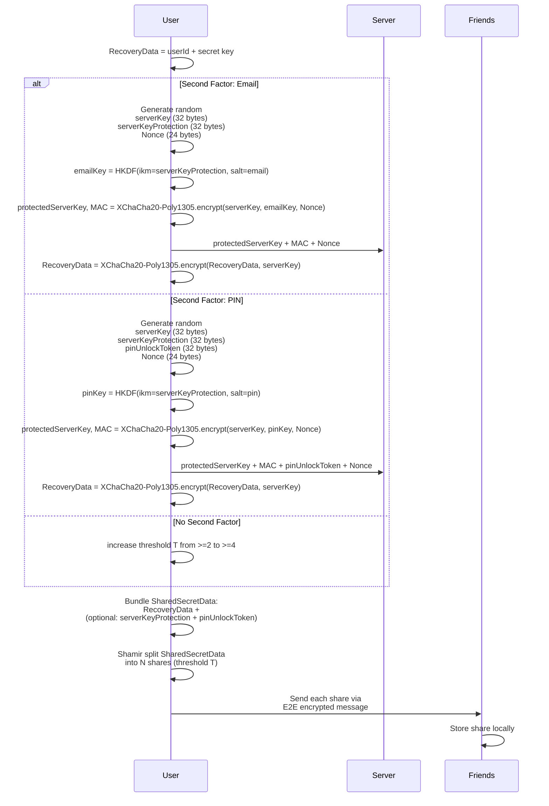
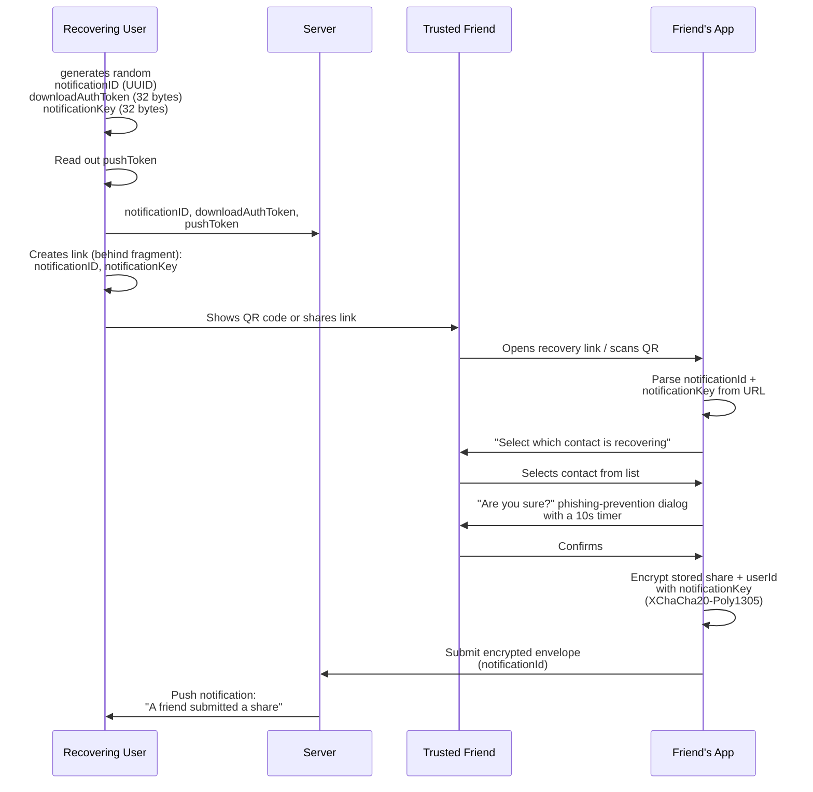
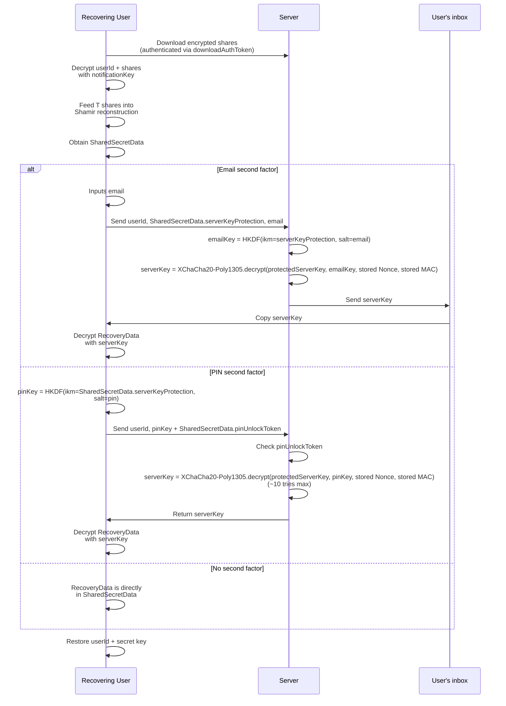

# Break my Passwordless Recovery Protocol and get a 50€ Bug-Bounty

A year ago I started building an Open-Source Snapchat alternative called [twonly](https://twonly.eu), as I liked the basic features of Snapchat, but wanted my images and text messages to not be [scanned](https://heise.de/-11246086), viewed by their [employees](https://www.vice.com/en/article/snapchat-employees-abused-data-access-spy-on-users-snaplion/), or potentially by attackers or [a government](https://www.bbc.com/news/world-europe-68099669). 

Directly from the start, users frequently lost access to their account after installing the app on a new device or losing their old phone. So a recovery mechanism was needed. Signal and WhatsApp use, beside their ([unencrypted (WhatsApp)](https://wire.com/en/blog/when-opt-in-security-fails-whatsapp-backup-example)) backup, the user's phone number to identify the user and allow them to reset their private key.

But I do not want to use phone numbers, as this would undermine the [users' privacy](https://twonly.eu/en/blog/2026-mutual-friends.html#the-problem-with-phone-numbers). Also, allowing users to recover their accounts using solely a phone number moves the Root of Trust from the private key to the phone number and with that to the server, which claims to have verified it. The server can then notify contacts about the user's new public key, which the clients accept. Yes, the clients show "Your safety numbers have changed", but this is ignored by almost all users (from my own experience).

As a starting point I decided to use a similar approach to [Threema's Safe](https://threema.com/en/faq/threema-safe-security), as the protocol was already designed and audited by experts. But this system requires the user to remember their password to protect the uploaded private key. And believe it or not, users frequently forget their password, again requiring them to recreate their account, losing all their friends, rejoining existing groups, and, in the case of an E2EE encrypted image backup which I am planning to implement, losing access to their precious images. To fix this I started designing a passwordless recovery protocol involving Trusted Friends and the server as a second factor. 

When involving friends to store a share of the user's secret key, it must be ensured that these are actually their friends' accounts and not an attacker impersonating their actual friends or a potentially compromised server performing an active MITM attack. For this, I already [rolled](https://twonly.eu/en/blog/2026-mutual-friends.html) out as part of [my master's thesis](https://mastodon.social/@twonly/115966775370449880) an improved Authentication Ceremony which users can more easily understand and which is partially automated via a Web of Trust approach. Users then can only select such verified friends.

But as I want this protocol to be secure, it should ideally be verified by external security professionals. However, as a student, I cannot afford a professional audit. So before releasing it to the public, I am starting a 50€ Bug Bounty challenge with this blog post. The deal: **You find a flaw in my protocol, you receive 50€.** And yes, this may not sound like much, but hey, I am a student and have to pay this out of my own pocket. At the end of this post, you will find the rules and the security goals for the bug bounty.

## The Passwordless Recovery Protocol

<strong>Update (July 19, 2026):</strong> I received feedback from a cryptography expert, who pointed out that my original trick of withholding the nonce from the server might work in practice, but it prevents a formal security proof under standard AEAD models. So I updated the protocol: Instead of the nonce, the encryption key for the serverKey is now withheld, distributed to the trusted friends, and only sent to the server during the recovery.

To enable the passwordless recovery, a user first has to select at least **T + 2** verified trusted friends (N), where T is the threshold for [Shamir's Secret Sharing](https://en.wikipedia.org/wiki/Shamir%27s_secret_sharing). The + 2 is there so that even if a couple of friends lose their phone or become unreachable, there are still enough shares left to recover. Then they can decide to enable a second factor, either a PIN or an email. From there, the user has finished their task. In the background the user's secret key is then split into multiple parts and then distributed to the selected friends. In case the second factor was enabled, these shares are further encrypted using a server key. Here is the full setup flow:

Because the server does not receive the `serverKeyProtection` (32 bytes), the server is unable to brute-force the user's email or PIN. But because it has the MAC, it can then during recovery ensure that it received the original user's input.

### Recovery Flow

When a user now forgets their backup password and has enabled the passwordless recovery, they can ask their friends to send them their shares. For this, the following flow is used to make it as easy as possible for all participants:

A symmetric encryption key was deliberately chosen over an asymmetric keypair: the goal is to protect submitted shares from the server, not from the user. Only the user holding the downloadAuthToken can download the submissions, and only the one holding the notificationKey can decrypt them. This makes the protocol post-quantum safe from the start, without requiring large public keys which cannot be shared via a QR code or a link.

To reduce potential phishing attacks, the user must manually select which friend they want to help, and then confirm their selection. This confirmation has a 10s timer and a red warning, asking them if they are sure that they have been asked by the selected user via a secure channel (like in-person or via Signal).

In the last step, the recovering user now can use the collected shares to recover their secret key:

The server will automatically delete the `protectedServerKey` when more than 10 tries for the PIN were performed. The reason for the `pinUnlockToken` is to prevent denial-of-service: without it, anyone could just spam the recovery endpoint with wrong keys and trigger the 10-attempt lockout, permanently destroying the user's `protectedServerKey`. Since only the trusted friends hold the Shamir shares containing the `pinUnlockToken`, only they (in case they collude) or the legitimate recovering user can actually initiate a recovery attempt.

As this protocol is designed to only recover small amounts of data (the secret key), this is combined with an encrypted backup in the cloud, which is protected by the user's secret key that can then be downloaded by the user, restoring their contacts, messages and images.

## Rules

- Below is a list of my security goals; compromise at least one and you qualify for the 50€ Bug-Bounty. If you find another security issue or encounter any other problem, I'm all ears.
- You can ask your agent, but you must disclose that, as I am curious what you prompted :).
- First come, first served. The bug-bounty is limited to one payout. Sorry, I am a student :/
- I reserve the right to decide for myself if the flaw is worth the bug bounty payout.
- The Bug-Bounty is only paid out in Cash, Bank-Transfer, or WERO.

### Security Goals

- The server should not be able to link a user and an email until the user recovers their account.
- The server should not be able to get access to the plaintext PIN.
- The server should never be able to get access to the user's secret key.
- A single trusted friend should never be able to recover the user's secret key on their own.
- The trusted friends should, in case the second factor is enabled, not be able to collude and recover the user's secret key.

### Assumptions

- The server does not collude with the trusted friends.
- The trusted friends are unable to guess the user's PIN with under 10 attempts.
- The trusted friends are unable to access the user's inbox.
- In case of no second factor, the trusted friends (at least 4) do not collude.

## Contact

If you have found something, please send either an [email](mailto:security@tsmr.eu) or find me on Signal: tobi.02.